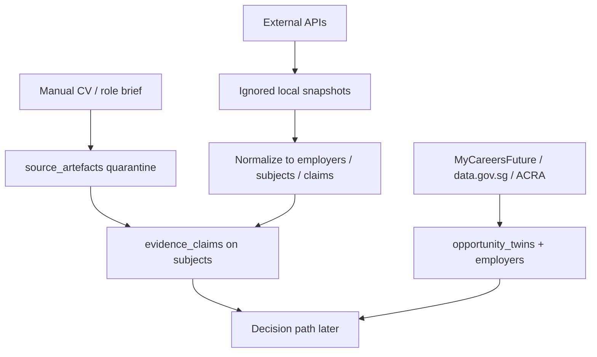

# Data sources


**Scope:** Talent V0.1 POC. Manual CV upload is the primary POC intake. External APIs are enrichment and market-context sources. Vendor ranking scores and outreach copy are **not** Timur decision authority.


This page is the shared tracker for **GitHub** and **GitBook**. Update status here when keys land, adapters change, or a source is accepted/rejected.

Engineering code: `@timur/providers` · local keys: `.local/providers.env` (never commit) · snapshots: `.local/provider-snapshots/`

## Goals

1. Grow a **tenant-scoped** employer / subject / evidence graph before Azure is ready.
2. Keep **provenance** on every assertion (provider, artefact hash, observed time, verification state).
3. Prefer **Singapore-credible** company and market sources (UEN, MyCareersFuture) alongside global enrichers.
4. Gate personal/contact data behind **purpose and authority** before production or controlled-data use.

## How we achieve it



**Schema first (local PostgreSQL)**  
`0002_talent_domain` holds `employers`, `subjects`, `subject_external_ids`, `source_artefacts`, `authority_grants`, `evidence_claims`, `opportunity_twins` with RLS. Binaries stay under `.local/uploads/`; SQL stores metadata only.



**Manual POC intake**  
Recruiters upload CVs into quarantine (`provider=manual`). Parsing later emits claims; nothing auto-outreaches.



**Provider adapters**  
`@timur/providers` exposes one pull surface. Run `npm run providers:pull` with keys in `.local/providers.env`. Results land only in ignored snapshots until a load-to-DB job exists.



**Normalize with contracts**  
Map snapshots → employers / subjects / claims; validate with `@timur/contracts` where shapes apply; store `provider` + external IDs on `subject_external_ids`.



**Azure later**  
Same schema lineage; quarantine moves to blob containers (`quarantine` / `source`); keys move to Key Vault / managed identity. Do not copy POC personal data into production.




POC defaults remain **synthetic** in environment intent until controlled-data acceptance. Live enrichment pulls are for architecture seeding and must not be treated as an approved personal-data pilot.


## Status legend

| Status | Meaning |
| --- | --- |
| `wired` | Adapter exists in `@timur/providers` |
| `pulling` | Successfully returned data on a recent local pull |
| `needs_key` | Adapter ready; waiting on credential |
| `blocked` | Product/ToS/API limitation (no direct key path) |
| `deferred` | Interesting vendor; not wired until DPA / accuracy sample |
| `rejected` | Explicitly out of scope for V0.1 |

## Tracker — primary sources

Update the **Tracker** column when something changes. Owner is a role until named in ops inventory.

| Source | Use in Timur | Env / access | Adapter | Tracker | Owner |
| --- | --- | --- | --- | --- | --- |
| Manual upload | Primary POC CV / briefs | Local `.local/uploads/` | schema + runbooks | `wired` — upload API pending | application |
| [Crustdata](https://crustdata.com/) | Company identify + people search/enrich | `CRUSTDATA_API_KEY` | `crustdata` | `pulling` | platform |
| [DINQ](https://dinq.me/) | NL talent search (GitHub/Scholar/LinkedIn signals) | `DINQ_API_KEY` | `dinq` | `needs_key` | platform |
| [People Data Labs](https://www.peopledatalabs.com/) | Person/company enrich + search | `PEOPLEDATALABS_API_KEY` | `peopledatalabs` | `needs_key` | platform |
| [Apollo](https://www.apollo.io/) | Company/people enrich | `APOLLO_API_KEY` | `apollo` | `needs_key` | platform |
| [ZoomInfo](https://www.zoominfo.com/) | Enterprise B2B graph | `ZOOMINFO_ACCESS_TOKEN` | `zoominfo` | `needs_key` | platform |
| [Cognism](https://www.cognism.com/) | Verified contacts | `COGNISM_API_KEY` | `cognism` | `needs_key` | platform |
| [Lusha](https://www.lusha.com/) | Lightweight contact enrich | `LUSHA_API_KEY` | `lusha` | `needs_key` | platform |
| [The Org](https://theorg.com/) | Org charts / reporting lines | `THEORG_API_KEY` | `theorg` | `needs_key` | platform |
| [Hunter](https://hunter.io/) | Work email find/verify | `HUNTER_API_KEY` | `hunter` | `needs_key` | platform |
| [Proxycurl](https://nubela.co/proxycurl/) | LinkedIn URL → profile/company | `PROXYCURL_API_KEY` | `proxycurl` | `needs_key` | platform |
| LinkedIn official API | Direct people search | Partner app only | `linkedin` (stub) | `blocked` — use Proxycurl/Crustdata/DINQ | product |
| [GitHub](https://docs.github.com/en/rest) | Public eng/org signals | optional `GITHUB_TOKEN` | `github` | `pulling` | platform |
| [Hugging Face](https://huggingface.co/docs/hub/api) | Model/author signals | optional `HF_TOKEN` | `huggingface` | `pulling` | platform |
| [OpenCorporates](https://opencorporates.com/) | Legal entities / officers | `OPENCORPORATES_API_TOKEN` | `opencorporates` | `needs_key` | platform |
| [ACRA / Bizfile](https://www.acra.gov.sg/resources/eservice-tools-portals/api-marketplace/) | SG UEN / company facts | `ACRA_BIZFILE_API_KEY` | `acra_bizfile` | `needs_key` | data steward |
| [MyCareersFuture](https://www.mycareersfuture.gov.sg/) | Role market, skills, salary bands | none (public search) | `mycareersfuture` | `pulling` | product |
| [data.gov.sg](https://data.gov.sg/) | Open gov datasets (context) | none (API v2) | `datagovsg` | `pulling` | platform |
| First-party agency history | Authorized placements / consented CVs | Internal systems | not an HTTP adapter | `deferred` — highest trust path | data steward |

## Tracker — deferred peers

| Source | Why deferred | Tracker |
| --- | --- | --- |
| DataLayer, Huntr, CompanyEnrich, AgentEnrich | Agent-native GTM APIs; need DPA + SG role-family accuracy sample | `deferred` |
| Clearbit / HubSpot Breeze | Marketing-graph oriented; overlap with existing enrichers | `deferred` |
| DIY LinkedIn scraping | ToS / legal / fragility | `rejected` |

## Delivery checklist (tracker)

- [x] Dual-env intent keeps `live_data_accepted: false` until acceptance
- [x] Local schema for employers / subjects / artefacts / claims
- [x] Provider package with skip-if-no-key behaviour
- [x] Crustdata + public sources producing local snapshots
- [ ] Named owners for each `needs_key` row
- [ ] DINQ key + first accepted search query for a frozen role family
- [ ] Snapshot → PostgreSQL loader (idempotent, tenant-scoped)
- [ ] Authority grant bootstrap before contact-enrich fields
- [ ] ACRA/Bizfile UEN join for Singapore employers
- [ ] Evaluation freeze (role family + acceptance thresholds) before quality claims
- [ ] Azure blob quarantine + Key Vault for provider secrets

## Related

- Engineering provider list: [data-source-providers.md](../plans/data-source-providers.md)
- Architecture baseline: [baseline.md](baseline.md)
- Access and retention: [access-and-retention.md](../security/access-and-retention.md)
- Implementation roadmap: [implementation-roadmap.md](../plans/implementation-roadmap.md)
- Code: `packages/providers/` · example env: `config/environments/providers.env.example`
